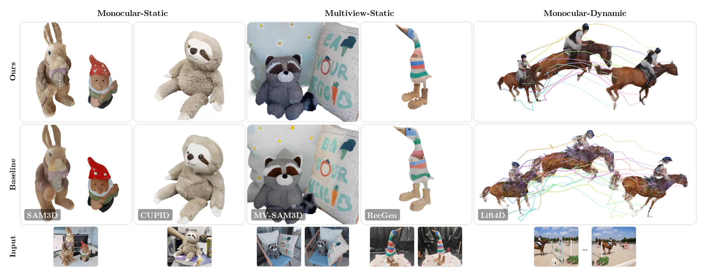

<!-- Copyright (c) Meta Platforms, Inc. and affiliates. -->

# GenIA

### Generative Reconstruction with Test-Time Input Alignment

### [Project Page](https://facebookresearch.github.io/GenIA/) | [Paper](https://arxiv.org/abs/2610.12388)


[Stefano Esposito](https://s-esposito.github.io)<sup>1</sup>,
[Naama Pearl](https://naamapearl.github.io/)<sup>1</sup>,
[Polina Karpikova](https://poliik.github.io/)<sup>1</sup>,
[Samuel Rota Bulò](https://scholar.google.com/citations?user=484sccEAAAAJ&hl=it)<sup>2</sup>,
[Lorenzo Porzi](https://scholar.google.it/citations?user=vW1gaVEAAAAJ&hl=it)<sup>2</sup>,
[Peter Kontschieder](https://scholar.google.co.uk/citations?user=CxbDDRMAAAAJ&hl=en)<sup>2</sup>,
[Andreas Geiger](https://www.cvlibs.net/)<sup>1</sup>,
[Jonathon Luiten](https://scholar.google.com/citations?user=XpOqG0cAAAAJ&hl=en)<sup>3</sup>
<br>
<sup>1</sup>Tübingen AI Center, University of Tübingen, <sup>2</sup>Meta, Zürich, <sup>3</sup>Meta, USA

<p align="middle">
  
</p>

GenIA reconstructs complete, detailed and input-aligned 3D objects from a single image,
a few views of a static scene, or a monocular video. It keeps the generative prior of
SAM 3D Objects frozen and **aligns it to the observations at inference time** with
geometric and photometric constraints: no retraining, no weight updates. The output is a
canonical object (Gaussians and a mesh) with per-frame poses and, for video, a
per-frame deformation.


## 🛠️ Installation

Requires conda, a CUDA 12.8 toolkit and an NVIDIA GPU.

```bash
git clone https://github.com/facebookresearch/GenIA && cd GenIA
bash install.sh && conda activate genia   # also fetches the submodules
python -m genia.core.download_weights   # all model weights (accept the SAM 3D Objects licence on Hugging Face first)
```


## 🚀 Demo

`demo/data/` holds example inputs for the three settings:

```bash
python demo/run_demo.py image       # a single image
python demo/run_demo.py multiview   # a few views of a static scene
python demo/run_demo.py dynamic     # a monocular video (shapes from ActionMesh)
```

Results are written to `results/`. To run your own data, add it as a new scene folder
under `demo/data/<setting>/`, laid out like the examples, and pass `--scene <name>`.
See [docs/configuration.md](docs/configuration.md) for the configuration options.


## 📜 License

This project is licensed under the **Creative Commons Attribution-NonCommercial 4.0
International License (CC BY-NC 4.0)**. See the [LICENSE](LICENSE) file for details.

Third-party components keep their own licences, several of them non-commercial; see
[THIRD_PARTY_LICENSES.md](THIRD_PARTY_LICENSES.md) before any use.


## 📚 Citation

If you use this work in your research, please consider citing:

```bibtex
@article{esposito2026genia,
  title   = {GenIA: Generative Reconstruction with Test-Time Input Alignment},
  author  = {Esposito, Stefano and Pearl, Naama and Karpikova, Polina and
             Rota Bul{\`o}, Samuel and Porzi, Lorenzo and Kontschieder, Peter and
             Geiger, Andreas and Luiten, Jonathon},
  journal = {arXiv preprint arXiv:2610.12388},
  year    = {2026}
}
```


## 🙏 Acknowledgements

Built on [SAM 3D Objects](https://github.com/facebookresearch/sam-3d-objects). Geometry
from [MapAnything](https://github.com/facebookresearch/map-anything) and
[MoGe](https://github.com/microsoft/MoGe); dynamic shapes from
[ActionMesh](https://github.com/facebookresearch/ActionMesh); rendering via
[gsplat](https://github.com/nerfstudio-project/gsplat) and
[nvdiffrast](https://github.com/NVlabs/nvdiffrast).
